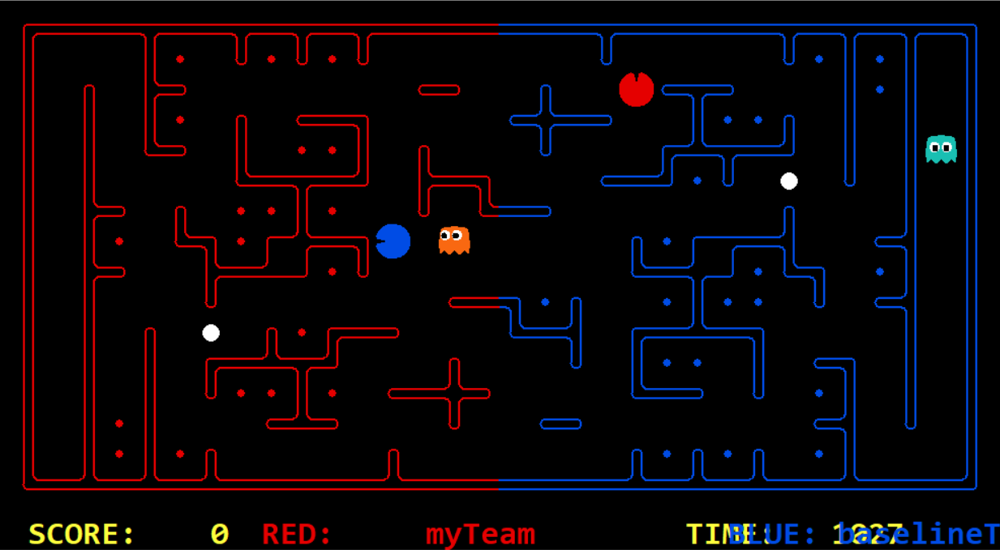

# Pacman Capture the Flag: Team 2Pac

The tournament was taken from the final project of UC Berkeley's CS 188 Artificial Intelligence class and used in our respective class at UC Santa Cruz. Overall, it involves a multi-player capture-the-flag variant of Pacman, where agents control both pacman and ghosts in coordinated team-based strategies. The premise is for a team to eat the food on the far side of the map, while defending the food on its home side.

For 10 days this tournament was run every night at 10pm, where each team in the class competed against every other team in a round-robin fashion. Results were automatically uploaded to a webpage around 3am. Our team name: **2Pac**.

## Notes:

|                  Branch                 |                                       Description                                      |
|:---------------------------------------:|----------------------------------------------------------------------------------------|
| [`master`](../../tree/master)           | Contains provided/unmodified code.                                                     |
| [`development`](../../tree/development) | Copy of `master` (remains unused).                                                     |
| [`stephen`](../../tree/stephen)         | Used for Stephen's working code.                                                       |
| [`yona`](../../tree/yona/)              | Used for my working code. Contains final submitted code (similar to `stephen` branch). |
| [`yona-patch1`](../../tree/yona-patch1) | Used for my testing of new/potential strategies.                                       |

* Summary of how we represented the problem, our computational strategies, obstacles we faced, and the "methods to our madness" (or so to speak):
  * [`writeup.pdf`](./writeup.pdf)
* File containing our team's agent code/the only file we submitted--*link goes to a different branch*: 
  * [`myTeam.py`](../yona/myTeam.py)
* Overview of the tournament rules and given code:
  * [`instructions.html`](./instructions.html)
* Check the other branches for our work.

## A few handy commands:

* Run a basic game:
  * `python capture.py`
* Run game with specified Red and Blue teams (baselineTeam shown here for both):
  * `python capture.py -r baselineTeam -b baselineTeam`
* Run game controlling agent0 with arrowkeys, random seeded layout 5, & time 2400:
  * `python capture.py --keys0 -l RANDOM5 -i 2400`
* Run game replay from .rec file:
  * `python capture.py --replay=<filename>`
* Get list/info of all options and comands:
  * `python capture.py --help`
